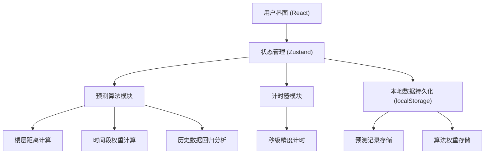
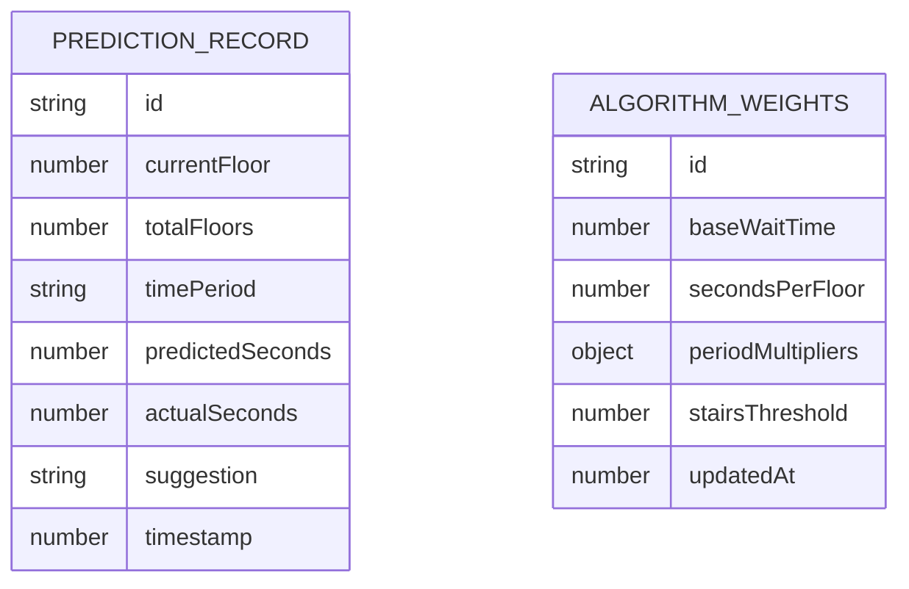

## 1. 架构设计



## 2. 技术说明

- **前端**: React@18 + TypeScript + Vite
- **样式**: TailwindCSS@3
- **状态管理**: Zustand
- **图标**: lucide-react
- **数据持久化**: localStorage（无需后端）
- **初始化工具**: vite-init

## 3. 路由定义

| 路由 | 用途 |
|-------|---------|
| / | 主页 - 预测面板、计时器、历史记录 |

## 4. 数据模型

### 4.1 数据模型定义



### 4.2 预测算法说明

**核心公式**:
```
预计等待时间 = 基础等待时间 + (楼层差 × 每层耗时) × 时间段系数 × 历史修正系数
```

- 基础等待时间：默认 8 秒（电梯门开关+人员进出）
- 每层耗时：默认 2.5 秒
- 时间段系数：
  - 早高峰：1.8x
  - 午间：1.3x
  - 晚高峰：1.9x
  - 其他时段：1.0x
- 历史修正系数：基于最近 20 条记录的预测误差平均值动态调整

**决策逻辑**:
- 预计等待时间 ≤ 阈值（默认 45 秒）或 楼层差 ≤ 3 层 → 建议"等电梯"
- 预计等待时间 > 阈值 且 楼层差 > 3 层 → 建议"走楼梯"
