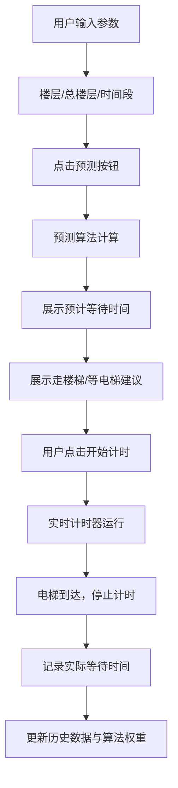

## 1. 产品概述

电梯等待时间预测小工具，帮助办公楼/商场用户根据所在楼层、总楼层数和当前时间段，智能预测电梯等待时间，并给出"走楼梯/等电梯"的决策建议。通过用户实际记录的等待时间数据，持续优化预测算法的准确性。

## 2. 核心功能

### 2.1 功能模块

1. **主页（预测面板）**: 楼层选择、时间段选择、预测结果展示、建议提示、实时计时器、历史记录展示

### 2.2 页面详情

| 页面名称 | 模块名称 | 功能描述 |
|-----------|-------------|---------------------|
| 主页 | 楼层选择器 | 用户输入所在楼层（1-总楼层数）和总楼层数（2-100） |
| 主页 | 时间段选择器 | 选择早高峰（7:00-10:00）、午间（11:00-14:00）、晚高峰（17:00-20:00）、其他时段 |
| 主页 | 预测结果区 | 展示预计等待时间（秒/分钟）、置信度、建议（走楼梯/等电梯） |
| 主页 | 实时计时器 | 开始/停止计时，记录实际等待时间，保存用于算法优化 |
| 主页 | 历史记录 | 展示最近的预测记录和实际等待时间，显示预测准确度趋势 |

## 3. 核心流程

用户打开页面 → 输入所在楼层和总楼层数 → 选择当前时间段 → 点击"预测等待时间" → 系统基于预设算法计算预计时间 → 显示预测结果和建议 → 用户点击"开始计时"记录实际等待 → 电梯到达后停止计时 → 系统保存记录并更新预测模型权重。

## 4. 用户界面设计

### 4.1 设计风格

- **主色调**: 深邃靛蓝 #1e3a5f（科技感、专业感）搭配活力橙 #ff6b35（提醒、行动）
- **辅助色**: 薄荷绿 #2ec4b6（建议走楼梯）、珊瑚红 #e71d36（建议等电梯）
- **按钮风格**: 圆角胶囊按钮，带微悬浮效果，主按钮使用渐变色
- **字体**: 标题使用 Space Grotesk（现代几何感），正文使用 DM Sans（清晰易读）
- **布局风格**: 玻璃拟态卡片，半透明背景配合模糊效果，深色科技主题
- **图标**: 使用 lucide-react 图标库，线性风格，统一 24px 尺寸

### 4.2 页面设计概述

| 页面名称 | 模块名称 | UI 元素 |
|-----------|-------------|-------------|
| 主页 | 楼层输入 | 数字输入框，带加减按钮，玻璃拟态背景，深色主题 |
| 主页 | 时间段选择 | 分段控制器（Segmented Control），选中态高亮，图标+文字 |
| 主页 | 预测结果 | 大号数字展示预计时间，脉冲动画，置信度进度条 |
| 主页 | 建议卡片 | 根据建议显示绿色或红色背景，大图标+文字说明 |
| 主页 | 计时器 | 圆形进度环计时器，开始/停止按钮，动态颜色变化 |
| 主页 | 历史记录 | 可展开列表，显示时间差，预测准确度标签 |

### 4.3 响应式

- 桌面端优先设计（1280px+）
- 平板端（768-1279px）：单列布局，卡片全宽
- 移动端（<768px）：紧凑间距，字号适配，触控友好按钮
- 触控区域不小于 44×44px
